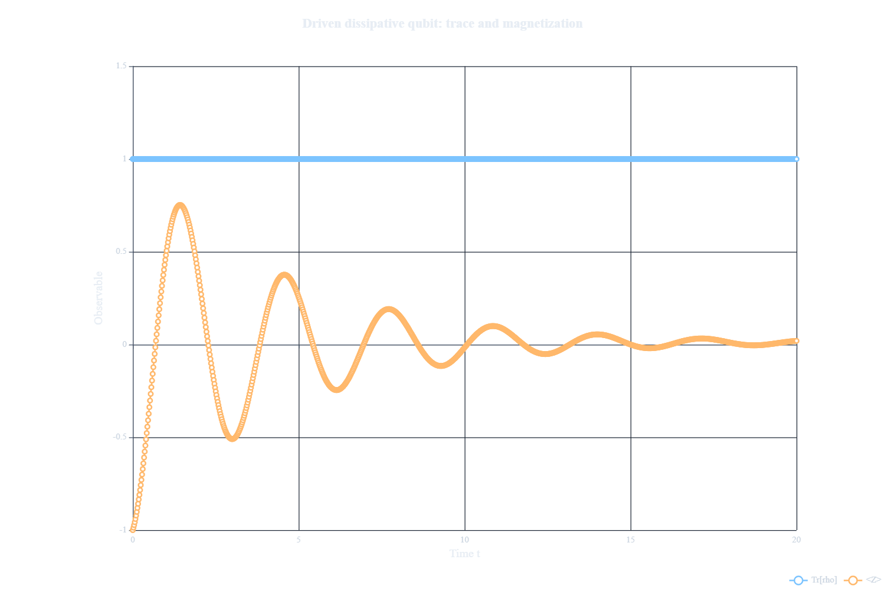

# Lindblad Master Equations: from GKLS to Liouville Space and Krylov Propagation

Perfect isolation is the exception, not the rule. In practice, quantum devices and many-body platforms are subject to weak measurement back-action, uncontrolled noise, finite-temperature baths, and (when we are ambitious) **engineered dissipation** as a tool rather than a nuisance. When the environment “forgets” rapidly compared to the system’s intrinsic timescales (the **Markovian regime**), the reduced dynamics of the system can often be captured by the **Gorini–Kossakowski–Sudarshan–Lindblad (GKLS)** master equation. In this tutorial, we will use GKLS dynamics as a concrete way to introduce a useful computational idea: instead of evolving the density matrix as a matrix-valued object, we rewrite the problem as a linear evolution in **Liouville space**.


## What we will build in this tutorial

We will first identify when the GKLS master equation is a valid description and what each term means physically. Then, we'll rewrite the master equation as a linear system by **vectorizing** the density matrix (Liouville-space “doubling”), and we'll implement that machinery in Aleph in a way that scales naturally beyond toy models.

As a first worked example, we will study a **driven dissipative single qubit** exhibiting **damped Rabi oscillations**, because this is the cleanest place to understand the structure of the GKLS equation, the meaning of the Liouvillian, and the practical subtleties of **Krylov time evolution** for a generally non-Hermitian generator. But this is not the final destination: the same vectorization strategy is precisely what we will later carry into a genuinely **open many-body** setting, where the goal is to keep the construction explicit while still evolving a system large enough to show real many-body Liouville-space dynamics.

## The GKLS equation

### How to read it

The GKLS equation for the density matrix $\rho(t)$ is

$$
\frac{d\rho}{dt}
=
-i[H,\rho]
+\sum_k \gamma_k\left(
L_k\rho L_k^\dagger
-\frac{1}{2}\{L_k^\dagger L_k,\rho\}
\right).
$$

A practical way for us to interpret it is visualizing it in two parts:

- **Coherent part**: the Hamiltonian $H$ generates unitary physics (Hamiltonian motion).
- **Dissipative channels**: the jump operators (or Lindblad operators) $L_k$ specify _which_ environmental processes act on the system (dephasing, relaxation, pumping, loss, etc.), while $\gamma_k$ sets _how strongly_ they act.

The first term is familiar from closed quantum dynamics: if the dissipative part were absent, the system would evolve unitarily according to the von Neumann equation. The second term is what makes the system open. It allows the environment to remove energy, inject excitations, destroy phase coherence, or drive the system toward a nonequilibrium steady state.

The structure of the dissipative term is also worth noticing. The piece $L_k\rho L_k^\dagger$ is the “jump” contribution, while the anticommutator contribution $-\frac{1}{2}\{L_k^\dagger L_k,\rho\}$ balances the evolution so that probability is not artificially created or destroyed. In other words, the density matrix may change its populations and coherences, but the total trace should remain

$$
\mathrm{Tr}(\rho)=1.
$$

This trace-preserving property will be one of our basic checks when we validate the Liouville-space construction in code.

### Regime of validity (why GKLS is justified)

GKLS is not an ad hoc model; it is the canonical form that arises when a microscopic system–environment description is reduced under standard conditions. In broad terms, it applies when:

- The coupling to the environment is **weak** (perturbative);
- The system and bath remain approximately **separable** (Born approximation);
- Bath correlations decay quickly so the dynamics is effectively **memoryless** (Markov approximation);
- Rapidly oscillating terms can be neglected due to timescale separation (**secular / rotating-wave** approximation).

Under these assumptions, the reduced evolution is completely positive and trace preserving, which is precisely why the GKLS structure is so widely used.

### Why should we vectorize at all?

Although GKLS is a first-order time equation, it is still an **operator-valued** equation: $\rho(t)$ is a $d\times d$ matrix, and the right-hand side contains left–right multiplications such as $L\rho L^\dagger$. Numerically, this is where the problem becomes interesting. There are two very different ways to proceed.

One route is to keep everything at the density-matrix level and repeatedly evaluate the master-equation right-hand side in matrix form. Another is to rewrite the dynamics as a **single linear problem** acting on a vectorized density matrix. The second route is what vectorization gives us. If we row-stack $\rho$ into a vector $|\rho\rangle\rangle\in\mathbb{C}^{d^2}$, the master equation becomes

$$
\frac{d}{dt}\,|\rho\rangle\rangle=\mathcal{L}\,|\rho\rangle\rangle,
\qquad
|\rho(t)\rangle\rangle=e^{t\mathcal{L}}|\rho(0)\rangle\rangle.
$$

At first sight this may look like we have made the problem larger, because the Liouvillian acts on a space of dimension $d^2$. But the real advantage is not merely formal. Once the dynamics has been rewritten in this way, we can bring the full toolbox of linear algebra to bear on it: applying operators to vectors, projecting into Krylov subspaces, and propagating in time without ever building a full matrix exponential.

That is precisely the point of the present implementation. We do **not** want to spend memory on a naive workflow that constructs large superoperators through explicit tensor-product bookkeeping and then exponentiates them directly. Instead, we use Aleph’s symbolic operator framework to represent the Liouvillian naturally on a doubled lattice, and then use Krylov propagation to apply the time-evolution operator to the vectorized density matrix. In that sense, vectorization is not just a change of notation, but it is the step that makes the numerical strategy both natural and scalable.

## The vectorization process

### The mathematical move

Pick a vectorization convention and define

$$
|\rho\rangle\rangle \equiv \mathrm{vec}(\rho)\in \mathbb{C}^{d^2}.
$$

In the code used in this tutorial, we use **row-stacking**. In other words, if $\rho$ is a $d\times d$ matrix, then

$$
\mathrm{vec}_{\mathrm{row}}(\rho)_{rd+c}=\rho_{r,c}.
$$

With this convention, the key identity is

$$
\mathrm{vec}_{\mathrm{row}}(A\rho B)
=
(A\otimes B^{\mathsf T})\,
\mathrm{vec}_{\mathrm{row}}(\rho),
$$

where $B^{\mathsf T}$ is the transpose of $B$. This is the identity that turns left–right multiplication into a single linear action on the vectorized state.

:::note
The choice of row-stacking is not physically special. What matters is using one convention consistently. The validation files check that the symbolic Liouville-space action agrees with the direct dense GKLS equation under this convention.
:::

### From GKLS to the Liouvillian

Using the identity above, the GKLS master equation becomes a standard linear ODE in Liouville space:

$$
\frac{d}{dt}|\rho(t)\rangle\rangle=\mathcal{L}\,|\rho(t)\rangle\rangle,
$$

where $\mathcal{L}$ is the **Liouvillian (Lindbladian superoperator)** (a $d^2\times d^2$ matrix). In the row-stacking convention used here, $\mathcal{L}$ can be written explicitly in terms of Kronecker products of $H$ and the jump operators $L_k$ as

$$
\mathcal{L}
=
-i\left(
H\otimes I
-
I\otimes H^{\mathsf T}
\right)
+
\sum_k \gamma_k
\left[
L_k\otimes L_k^*
-
\frac{1}{2}
\left(
L_k^\dagger L_k\otimes I
\right)
-
\frac{1}{2}
\left(
I\otimes (L_k^\dagger L_k)^{\mathsf T}
\right)
\right].
$$

:::tip
This is the key computational reframing: once you have $\mathcal{L}$, _open-system dynamics becomes linear algebra_. You can focus on “apply $\mathcal{L}$ (or functions of it) to a vector” rather than manipulating matrix-valued differential equations by hand.
:::

### The conceptual payoff

Once you have $\mathcal{L}$, the formal solution looks structurally like Schrödinger evolution—except generally **non-unitary**:

$$
|\rho(t+\Delta t)\rangle\rangle = e^{\Delta t\,\mathcal{L}}|\rho(t)\rangle\rangle.
$$

This is precisely where Aleph’s design philosophy becomes compelling: if you can apply an operator function $f(\mathcal{L})$ to a vector _without_ forming a full exponential, you inherit the same algorithmic advantages as in Krylov time evolution for closed systems. In practice, you treat time stepping as repeated applications of $e^{\Delta t\mathcal{L}}$, which is implemented efficiently via `operator_function(...)`.

### Where the computational advantage comes from

It is worth being very explicit about what is being optimized here. The physics is not being approximated in a new way; the improvement comes from choosing a better **representation** for the same generator of the dynamics.

A straightforward implementation of Liouville-space dynamics often becomes memory-hungry very early, because one writes every contribution to $\mathcal{L}$ as an explicit Kronecker product, assembles a dense $d^2\times d^2$ object, and then treats that object as the primary data structure throughout the calculation. This is workable for toy systems, but it quickly becomes a poor default once the Hilbert space starts growing.

The present approach takes a more Aleph-native route. Instead of thinking of the Liouvillian first as a giant dense matrix, we represent it symbolically as an operator on a **doubled lattice**: one copy for the ket index and one copy for the bra index. In that language, the coherent and dissipative pieces can be written directly in terms of operator actions on the forward and backward copies. This keeps the code close to the mathematics while avoiding a large amount of explicit tensor-product bookkeeping.

Only at the propagation stage do we pass that symbolic Liouvillian to the Krylov time-evolution routine. Even there, the central object is still not a full matrix exponential. What we repeatedly apply is the action of $e^{\Delta t\mathcal{L}}$ on a vectorized density matrix, evaluated through `operator_function(...)`. That is the practical numerical idea the tutorial should keep emphasizing: **avoid expensive explicit constructions as long as possible, and only compute the action you actually need.**

## Implementing GKLS vectorization

The previous section gave us the conceptual move: once the density matrix is vectorized, the GKLS equation becomes a linear evolution problem in Liouville space. The practical question is how to implement this without turning the tutorial into one large script where the physics, the validation, and the examples are all mixed together.

For that reason, the code is organized in layers. The reusable machinery lives in a core file, and the actual examples are kept as separate executable scripts.

The main files used in this tutorial are:

- [`liouville_core.aleph`](https://github.com/carlos-rib/gkls-liouville-krylov-aleph/blob/main/gkls_vec_tutorial/liouville_core.aleph)
- [`liouville_validation.aleph`](https://github.com/carlos-rib/gkls-liouville-krylov-aleph/blob/main/gkls_vec_tutorial/liouville_validation.aleph)
- [`01_single_qubit_validation.aleph`](https://github.com/carlos-rib/gkls-liouville-krylov-aleph/blob/main/gkls_vec_tutorial/01_single_qubit_validation.aleph)
- [`02_single_qubit_krylov_evolution.aleph`](https://github.com/carlos-rib/gkls-liouville-krylov-aleph/blob/main/gkls_vec_tutorial/02_single_qubit_krylov_evolution.aleph)
- [`03_stationary_closed_chain_open_dynamics.aleph`](https://github.com/carlos-rib/gkls-liouville-krylov-aleph/blob/main/gkls_vec_tutorial/03_stationary_closed_chain_open_dynamics.aleph)

The idea here is simple: first build and validate the Liouville-space machinery on small systems, then use the same machinery in the propagation examples.

:::tip
The snippets shown in the tutorial are intentionally selective. They are meant to highlight the structure of the implementation, not to replace the full source files.
:::

### The code layout

The implementation is centered around `liouville_core.aleph`.

This file contains the reusable pieces:

- Hilbert-space and Liouville-space dimension helpers;
- The doubled-lattice indexing convention;
- Row-stacking vectorization utilities;
- Symbolic coherent Liouvillian terms;
- Local Lindblad dissipators;
- Helpers for Krylov propagation;
- Liouville-space measurement bras.

The validation layer is kept separate:

```text
liouville_validation.aleph
01_single_qubit_validation.aleph
```

The role of these files is not to be large or physically impressive, but only make sure the convention is correct before we trust the many-body examples. They do that by comparing the symbolic Liouville-space construction against direct dense GKLS calculations in one-qubit cases.

After that, the first propagation examples are:

```text
02_single_qubit_krylov_evolution.aleph
03_stationary_closed_chain_open_dynamics.aleph
```

While the single-qubit file is the clean pedagogical example, the many-body file is where the same vectorization strategy is used on a larger open spin-chain problem.

### The doubled-lattice bookkeeping

For a chain of $N$ physical spin-$1/2$ sites, the Liouville-space construction acts on a doubled symbolic lattice.

We use the convention

```text
forward copy:   0, 1, ..., N-1
backward copy:  N, N+1, ..., 2N-1
```

The forward copy represents the action by the left on the density matrix, while the backward copy represents the action by the right, with the transpose structure required by the row-stacking convention.

In the core file, this bookkeeping is deliberately kept simple:

```aleph
def fwd(integer site) { return site }

def bwd(integer site, integer N) { return N + site }

def hilbert_dim(integer N) { return 2**N }

def liouville_dim(integer N) { return 4**N }

def rho_vec_index(integer row, integer col, integer d) {
    return row * d + col
}

def make_empty_liouvillian() {
    return operator_sum()
}
```

The function `rho_vec_index(row, col, d)` is where the row-stacking convention appears in code. Although it looks like a small indexing detail, it is one of the most important choices in the whole implementation. Once the convention is chosen, every left and right action in the Liouvillian has to respect it.

### Row-stacking helpers

For validation and small examples, it is useful to move explicitly between a density matrix and its row-stacked Liouville-space vector. For that, the core file contains the helpers

```aleph
def vec_dm_row(rho, integer d)
{
    var v = zeros([d * d], as_matrix)

    for (var row = 0; row < d; ++row)
    {
        for (var col = 0; col < d; ++col)
        {
            v[rho_vec_index(row, col, d)] = rho[row, col]
        }
    }

    return v
}

def unvec_dm_row(v, integer d)
{
    var rho = zeros([d, d], as_matrix)

    for (var row = 0; row < d; ++row)
    {
        for (var col = 0; col < d; ++col)
        {
            rho[row, col] = v[rho_vec_index(row, col, d)]
        }
    }

    return rho
}
```

These functions are mostly used when we want a transparent check against the ordinary density-matrix form of the GKLS equation. For larger examples, we avoid repeatedly reconstructing $\rho$ as a dense matrix inside the time loop. Instead, we keep the state in Liouville space and measure observables directly from the vectorized state.

### Building initial density vectors directly

For computational-basis product states, we do not need to build a full density matrix and then vectorize it. We can build the Liouville-space density vector directly.

For example, the helper

```aleph
def make_basis_density_vec(integer N, integer basis_index)
{
    var d = hilbert_dim(N)
    var rho_vec = zeros([d * d], as_matrix)

    rho_vec[rho_vec_index(basis_index, basis_index, d)] = 1.0 + 0.0i

    return rho_vec
}
```

constructs $\mathrm{vec}_{\mathrm{row}}(|b\rangle\langle b|)$ directly.

This is a small convenience in the single-qubit case, but it becomes more important in the many-body examples. The Liouville-space vector already has size $4^N$, so we want to avoid unnecessary dense matrix bookkeeping whenever possible.

### Coherent Liouvillian terms

The Liouvillian is assembled from small symbolic pieces that mirror the terms in the GKLS equation.

For example, a local coherent $X$ term is represented on the doubled lattice as

```aleph
def coherent_x_term(integer N, integer site, real coeff)
{
    var L = make_empty_liouvillian()

    L += ( 1i * coeff) * X(fwd(site))
    L += (-1i * coeff) * X(bwd(site, N))

    return L
}
```

The important point is not the local $X$ term itself, but the pattern: the Hamiltonian contribution is written as a difference between the forward and backward copies. This is the doubled-lattice version of the commutator structure in

$$
-i[H,\rho].
$$

The exact signs are fixed by the row-stacking convention and checked in the validation files.

### Local dissipators

Dissipative terms are built in the same spirit. A Lindblad channel has three pieces:

$$
L\rho L^\dagger
-\frac{1}{2}L^\dagger L\rho
-\frac{1}{2}\rho L^\dagger L.
$$

In the doubled-lattice representation, these become symbolic actions on the forward and backward copies. The core file contains lower-level helpers for local jump operators, and then exposes more physical dissipators such as

```aleph
decay_to_zero_dissipator(N, site, gamma)
pump_to_one_dissipator(N, site, gamma)
z_dephasing_dissipator(N, site, gamma)
```

This keeps the examples readable. Instead of writing the full Lindblad structure every time, the example files can say which physical channel is being used.

For instance, a relaxation channel can be added as

```aleph
L += decay_to_zero_dissipator(N, site, gamma)
```

while a pumping channel can be added as

```aleph
L += pump_to_one_dissipator(N, site, gamma)
```

The validation step below checks that these symbolic dissipators reproduce the direct dense GKLS action in small one-qubit cases.

### Why this structure is useful

At this point, the implementation has three separate responsibilities:

1. `liouville_core.aleph` defines the reusable Liouville-space machinery.
2. `liouville_validation.aleph` checks the convention against direct dense GKLS calculations.
3. The example files use the validated machinery for actual propagation.

This is the structure we will follow in the rest of the tutorial. We will first validate the construction in the simplest possible setting, and only then move to Krylov propagation and many-body dynamics.

### Validating the construction before propagating

Before using the Liouvillian for time evolution, we should check that the convention is actually correct. This is because, in Liouville space, a sign error, a wrong transpose, or an inconsistent vectorization convention can easily produce code that runs but represents the wrong master equation. So before moving to Krylov propagation, we first compare two ways of computing the same object:

1. Compute $\dot{\rho}$ directly from the dense GKLS equation, and then row-stack the result;
2. Apply the symbolic Liouvillian directly to the row-stacked density matrix.

In equations, the check is

$$
\mathrm{vec}_{\mathrm{row}}\!\left(\frac{d\rho}{dt}\right)
\stackrel{?}{=}
\mathcal{L}\,\mathrm{vec}_{\mathrm{row}}(\rho).
$$

The dense calculation is used only as a small-system reference. It is not the propagation strategy used later in the tutorial.

The validation code is split into two files:

```text
liouville_validation.aleph
01_single_qubit_validation.aleph
```

The file `liouville_validation.aleph` contains the reference checks. For example, the direct dense GKLS right-hand side is implemented as

```aleph
def direct_gkls_rhs(rho, H, jump_ops, gammas)
{
    var drho = -1i * (H * rho - rho * H)

    for (var k = 0; k < jump_ops.size(); ++k)
    {
        var jump = jump_ops[k]
        var gamma = gammas[k]

        var jump_dag = jump.adjointed()
        var jump_dag_jump = jump_dag * jump

        var jump_term = jump * rho * jump_dag
        var left_anticomm = jump_dag_jump * rho
        var right_anticomm = rho * jump_dag_jump

        drho += gamma * jump_term
        drho += (-0.5 * gamma) * left_anticomm
        drho += (-0.5 * gamma) * right_anticomm
    }

    return drho
}
```

Then the symbolic and dense routes are compared by row-stacking the dense result and applying the symbolic Liouvillian to the vectorized density matrix:

```aleph
def compare_direct_and_symbolic_rhs(
    Liouv,
    rho,
    H,
    jump_ops,
    gammas,
    integer d
)
{
    var drho_direct = direct_gkls_rhs(rho, H, jump_ops, gammas)
    var drho_direct_vec = vec_dm_row(drho_direct, d)

    var drho_symbolic_vec = symbolic_rhs_from_density_matrix(Liouv, rho, d)

    var err = norm(drho_direct_vec - drho_symbolic_vec)

    return err
}
```

The executable file `01_single_qubit_validation.aleph` simply runs the compact validation suite:

```aleph
include "gkls_vec_tutorial/liouville_validation.aleph"

print("")
print("============================================================")
print("Example 01: single-qubit symbolic Liouville validation")
print("============================================================")
print("")
print("This script validates the symbolic GKLS / Liouville-space core")
print("against direct dense GKLS calculations for N = 1.")
print("")
print("No dense Liouvillian matrix is constructed in the production path.")
print("Dense density-matrix calculations are used only as reference tests.")
print("")

run_core_validation_suite()

print("")
print("Example 01 finished.")
```

This suite checks several small but important cases:

- population flow for relaxation, using the jump $|0\rangle\langle 1|$;
- population flow for pumping, using the jump $|1\rangle\langle 0|$;
- dephasing;
- coherent one-qubit Hamiltonian terms;
- combined coherent and dissipative one-qubit GKLS dynamics;
- one-step trace preservation under symbolic Krylov propagation.

The point of these tests is not to show an impressive system size. The point is to make sure that the signs, transposes, vectorization convention, dissipators, and trace-preserving structure are all correct before the same machinery is reused in larger examples.

A successful run should report `PASS` throughout the validation suite. Once that happens, we can treat the core Liouville-space construction as validated and move on to actual time propagation.

### Krylov propagation in the single-qubit example

Once the Liouville-space construction has been validated, we can use it for actual time evolution. The first propagation example is kept deliberately small:

```text
02_single_qubit_krylov_evolution.aleph
```

It describes a single driven dissipative qubit with $H=\omega X$ and a relaxation channel $L=|0\rangle\langle 1|$.

The purpose of this example is not system size. It is to show the whole workflow in the cleanest possible setting: build the symbolic Liouvillian, construct the Krylov propagator, evolve the vectorized density matrix, and monitor simple physical observables.

The symbolic Liouvillian is assembled directly from the validated helpers in `liouville_core.aleph`:

```aleph
var Liouv = make_empty_liouvillian()

Liouv += coherent_x_term(N, 0, omega)
Liouv += decay_to_zero_dissipator(N, 0, gamma)

Liouv = cleanup_mixed_operator(Liouv, 1.0e-14)
```

This is the point of having a reusable core file. The example does not need to re-derive the doubled-lattice construction. It only states which Hamiltonian term and which dissipative channel are being used.

Then we build the Krylov representation of the one-step propagator:

```aleph
var U = make_liouville_expm(Liouv, dim_vec, dt, krylov_dim)
```

The helper `make_liouville_expm(...)` wraps the `operator_function(...)` call used for the generally non-Hermitian Liouvillian:

```aleph
def make_liouville_expm(Liouv, integer dim_vec, real dt, integer krylov_dim)
{
    var kdim = krylov_dim

    if (kdim > dim_vec)
    {
        kdim = dim_vec
    }

    var exp_dt_L = fun[dt](complex z, integer deriv_order) {
        return (dt ** deriv_order) * exp(dt * z)
    }

    return operator_function(Liouv, dim_vec, exp_dt_L, ["krylov_dimension": kdim])
}
```

Here the callback represents

$$
f(z)=e^{\Delta t z},
\qquad
f^{(n)}(z)=\Delta t^n e^{\Delta t z}.
$$

This derivative-aware form is useful because the Liouvillian of an open system is generally non-Hermitian.

The initial state is the excited state, $\rho(0)=|1\rangle\langle 1|$, built directly as a Liouville-space vector:

```aleph
var rho_vec = make_basis_density_vec(N, 1)
```

For this one-qubit example, we track the trace, the $Z$ expectation value, and the two populations. The measurement bras are also built once before the time loop:

```aleph
var trace_bra = make_trace_bra(N)
var z_bra = make_z_observable_bra(N, 0)
```

The time loop then stays entirely in Liouville space:

```aleph
for (var step = 0; step < n_total; ++step)
{
    var tr = real(dot(trace_bra, rho_vec))
    var z  = real(dot(z_bra, rho_vec))

    trace_values[step] = tr
    z_values[step] = z

    p0_values[step] = 0.5 * (tr + z)
    p1_values[step] = 0.5 * (tr - z)

    if (step < n_steps)
    {
        rho_vec = apply_liouville_step(U, rho_vec)
    }
}
```

This is the main pattern we want readers to notice. After initialization, the state is not repeatedly converted back into a dense density matrix inside the loop. The propagation and the basic measurements are done directly in Liouville space.

Physically, the Hamiltonian drives coherent oscillations between $|0\rangle$ and $|1\rangle$, while the dissipative channel transfers population from $|1\rangle$ to $|0\rangle$. Starting from $|1\rangle\langle 1|$, the excited-state population $p_1(t)=\langle 1|\rho(t)|1\rangle$ therefore shows the expected damped oscillatory behavior.

The two figures generated by the script summarize this first propagation test.


*Figure: Populations of the driven dissipative qubit. The Hamiltonian drive produces oscillations, while the relaxation channel damps the motion and transfers population toward the ground state.*



*Figure: Trace and $\langle Z\rangle$ during the same evolution. The trace remaining close to 1 is a basic diagnostic that the open-system propagation is behaving consistently.*

The first shows the populations $p_0(t)$ and $p_1(t)$. The second shows the trace and $\langle Z\rangle$. The trace curve is especially useful as a quick diagnostic: it should remain equal to 1 up to small numerical error.

## A many-body open-system example

The single-qubit example is useful because every step is easy to inspect. But the reason for building the Liouville-space machinery in this modular way is that the same workflow can be used beyond one qubit.

In this section, we move to a spin chain with exact Liouville-space propagation. The example is still chosen to be conceptually clean: the closed Hamiltonian alone leaves the initial state stationary, and the observed dynamics comes from the dissipative part.

The corresponding file is:

```text
03_stationary_closed_chain_open_dynamics.aleph
```

### Model

We consider a chain of $N$ spin-$1/2$ sites with Hamiltonian

$$
H
=
J_z\sum_i Z_iZ_{i+1}
+
h_z\sum_i Z_i.
$$

The initial state is a Néel-like computational-basis product state with even sites $|0\rangle$ and odd sites $|1\rangle$. Since this state is diagonal in the computational basis, and the Hamiltonian is also diagonal in the same basis, the closed-system commutator vanishes on the initial density matrix:

$$
[H,\rho(0)]=0.
$$

This is a useful design choice for the example. If we evolve only with the closed Hamiltonian, the state should remain stationary. Once we add local decay channels, any visible population dynamics is therefore coming from the open-system part of the GKLS equation.

The dissipative channel is local decay on every site,

$$
L_j = |0\rangle\langle 1|_j.
$$

So the open Liouvillian is

$$
\mathcal{L}_{\mathrm{open}}
=
\mathcal{L}_{\mathrm{closed}}
+
\sum_j \gamma\,\mathcal{D}[|0\rangle\langle 1|_j].
$$

### Building the closed and open Liouvillians

In the code, we build two symbolic Liouvillians. The first one contains only the coherent diagonal Ising Hamiltonian:

```aleph
var L_closed = diagonal_ising_coherent_liouvillian(N, Jz, hz)
L_closed = cleanup_pauli_operator(L_closed, 1.0e-14)
```

The second one starts from the same coherent part and then adds local decay channels on all sites:

```aleph
var L_open = diagonal_ising_coherent_liouvillian(N, Jz, hz)

for (var j = 0; j < N; ++j)
{
    L_open += decay_to_zero_dissipator(N, j, gamma)
}

L_open = cleanup_mixed_operator(L_open, 1.0e-14)
```

This gives us a clean comparison between a stationary closed baseline and an open evolution driven by local dissipators.

### Propagation

The two Liouvillians are propagated with the same Krylov helper used in the single-qubit example:

```aleph
var U_closed = make_liouville_expm(L_closed, dim_vec, dt, krylov_dim)
var U_open   = make_liouville_expm(L_open,   dim_vec, dt, krylov_dim)
```

The initial density vector is built directly from the computational-basis index:

```aleph
var initial_basis_index = make_neel_like_basis_index(N)
var rho_init = make_basis_density_vec(N, initial_basis_index)
```

Then the closed and open states are evolved side by side:

```aleph
var rho_closed = rho_init + zeros_like(rho_init)
var rho_open   = rho_init + zeros_like(rho_init)

for (var step = 0; step < n_total; ++step)
{
    var tr_closed = real(dot(trace_bra, rho_closed))
    var tr_open   = real(dot(trace_bra, rho_open))

    var tz_closed = real(dot(total_z_bra, rho_closed))
    var tz_open   = real(dot(total_z_bra, rho_open))

    var sz_closed = real(dot(staggered_z_bra, rho_closed))
    var sz_open   = real(dot(staggered_z_bra, rho_open))

    trace_closed[step] = tr_closed
    trace_open[step]   = tr_open

    total_z_closed[step] = tz_closed
    total_z_open[step]   = tz_open

    stag_z_closed[step] = sz_closed
    stag_z_open[step]   = sz_open

    if (step < n_steps)
    {
        rho_closed = apply_liouville_step(U_closed, rho_closed)
        rho_open   = apply_liouville_step(U_open, rho_open)
    }
}
```

The important point is that the structure is the same as before. We build the symbolic Liouvillian, construct the Krylov propagator, and keep the state in Liouville space during the time loop.

### Observables

For the many-body example, the script tracks four diagnostics:

```text
Tr(rho)
sum_i <Z_i>
sum_i (-1)^i <Z_i>
final <Z_i> profile
```

The total $Z$ magnetization,

$$
\sum_i \langle Z_i\rangle,
$$

shows the net effect of local relaxation. The staggered observable,

$$
\sum_i (-1)^i\langle Z_i\rangle,
$$

is useful because the initial state has an alternating pattern. As local decay pushes sites toward $|0\rangle$, that staggered pattern relaxes.

The trace is again a consistency check. Even though the open dynamics changes the state, it should not change the total probability.

### Suggested run

For a genuine many-body example, we should run this file with at least

```text
N=10
```

For example:

```text
N=10
Jz=1.0
hz=0.3
gamma=0.2
dt=0.05
n_steps=160
krylov_dim=20
```

At this size, the Hilbert-space dimension is

$$
d=2^{10}=1024,
$$

and the Liouville-space vector has dimension

$$
d^2=4^{10}=1,048,576.
$$

This is still exact Liouville-space propagation, but it is no longer a toy one-qubit problem. It is large enough to show why organizing the construction carefully matters.

### Reading the output

The run finishes with the expected closed-vs-open contrast.

In the closed evolution, the observables remain fixed. This is the reference behavior we wanted: the initial product state is stationary under the diagonal Hamiltonian, so the closed chain gives us a clean baseline.

In the open evolution, the dissipative channels gradually relax the initially excited odd sites. This is why the total $Z$ increases, while the staggered $Z$ decreases. The dynamics is not coming from coherent spin flips; it is the irreversible part of the GKLS equation doing exactly what it was designed to do in this example.

The final diagnostics summarize this clearly:

```text
max |Tr_closed - 1| = 0
max |Tr_open   - 1| = 3.19744231092045e-14

total Z closed at t=0 = 0
total Z closed at T   = 0
total Z open   at t=0 = 0
total Z open   at T   = 7.98103482005369

staggered Z closed at t=0 = 10
staggered Z closed at T   = 10
staggered Z open   at t=0 = 10
staggered Z open   at T   = 2.01896517994662
```

The trace error stays at the level of numerical precision, while the open-system observables change substantially. This is exactly the combination we want: nontrivial dissipative dynamics without loss of probability.


The total $Z$ curve is the most direct signature of relaxation. The closed chain remains at zero throughout the run. The open chain rises monotonically and reaches approximately $7.98$ by the final time. Physically, this means that the sites initially in $|1\rangle$ are being pushed toward $|0\rangle$, increasing their local $Z$ expectation values.


The staggered observable shows the decay of the initial alternating pattern. In the closed chain, the value stays pinned at $10$. In the open chain, it falls to approximately $2.02$. This is the same relaxation process seen from a different angle: as the odd sites move upward, the original Néel-like contrast is progressively erased.


The final site-resolved profile makes the mechanism especially clear. The closed profile is still the original alternating pattern. In the open profile, the even sites remain close to $+1$, while the odd sites have moved from $-1$ to roughly $0.6$. The system has not fully reached the all $|0\rangle$ configuration yet, but the direction of the relaxation is already unmistakable.


Finally, the trace plot is the numerical sanity check. Both the closed and open evolutions preserve $\mathrm{Tr}(\rho)=1$ throughout the run. For the open chain, the maximum deviation is about $3.2\times 10^{-14}$, which is consistent with floating-point error.

## What's next?

This tutorial stops at a deliberately clean many-body example, but the same Liouville-space structure can be pushed in several directions. Here are a few natural things to try next:

- Replace the diagonal Ising Hamiltonian by a Hamiltonian that actually moves population, for example by adding $X$, $XX+YY$, or transverse-field terms. How does the picture change when the closed system is no longer stationary?

- Modify the dissipative channels. What happens if decay acts only at the boundaries? What if one edge pumps excitations while the other removes them?

- Track other observables directly in Liouville space. For example, instead of only measuring total $Z$, staggered $Z$, and the final profile, can you follow local magnetization profiles or two-point correlations during the evolution?

- Vary the Krylov dimension and the time step. How stable are the observables? At what point do the trace and physical curves start to visibly change?

- Increase the system size. Since the Liouville-space dimension grows as $4^N$, how far can you push exact propagation on your machine before runtime or memory becomes the limiting factor?

- Try a less minimal many-body model, such as boundary-driven XXZ or a $J_1$-$J_2$ XXZ chain. Does the same code organization still make the model easy to build and inspect?


